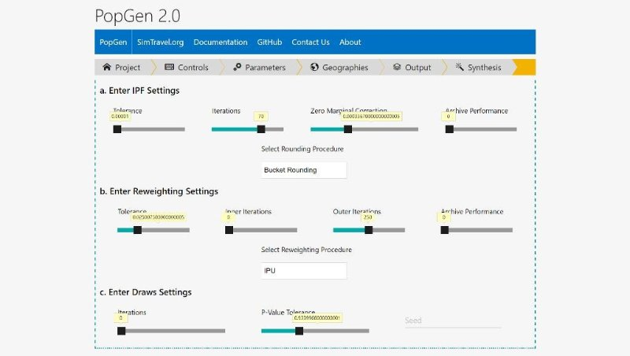

# PopGen Web GUI
GUI to generate YAML files for the PopGen 2.0 Command Line. User can upload their data files and adjust all the parameters to generate the .yaml configuration and input for the PopGen 2.0 Command Line. The codebase is largely is in HTML/PHP using the bootstrap framework.

PopGen 2 is available here: [PopGen](https://github.com/foss-transportationmodeling/popgen) 

# Stay Updated
The Latest Releases of PopGen, News and User Guides are available at [MARG](https://www.mobilityanalytics.org/popgen.htmlhttps://github.com/foss-transportationmodeling/popgen) 

